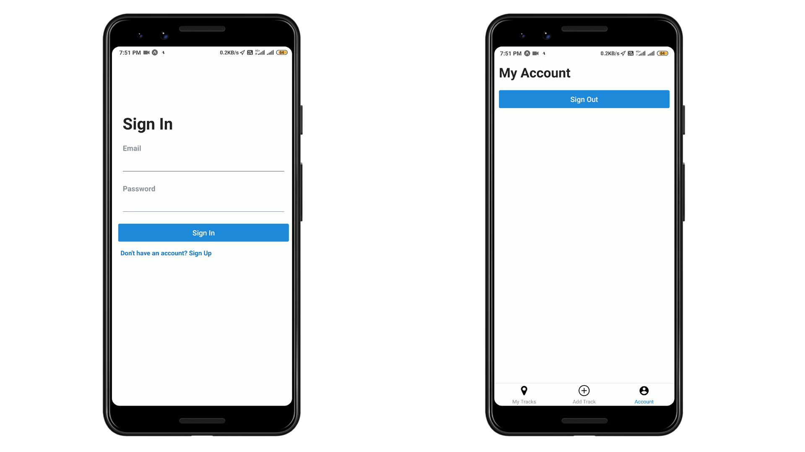

# Geo-Tracker App

# Purpose
In these COVID times,it's necessary to keep track of the routes that we've taken through to be 
aware of the the source location of the disease. If someone contracts virus, this app can help
us narrow down the location of contraction and this can prove useful to others also.

# Features
<li>Basic authentication features including user signup/signin</li>
<li>As an authenticated user, I can save the tracks/routes that I've walked through</li>
<li>As an authenticated user, I can see my past history of routes that I've taken</li>
<li>Used ngrok for bypassing the localhost address and converting it into a useable form for mobiles (both IOS and Android)</li>
<li>Fronted is purely React Native with the backend supported by Express and MongoDB</li> 

# Built with
<li>Nodejs</li>
<li>MongoDB</li>
<li>React Native</li>
<li>JWT Authentication</li>
<li>React Maps</li>

---
**NOTE**
<ol>
  <li>MONGODB_URI = "Your database link"</li>
  <li>JWT_SECRET = "Some random string"</li>

---

